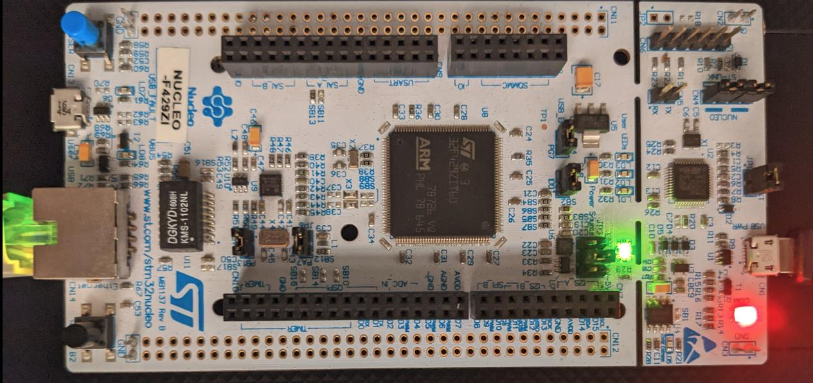

# NUCLEO-F429ZI examples

This directory contains examples to demonstrate using libcoapcpp library on NUCLEO-F429ZI board.

## Introduction
Before using these examples make sure you have installed following packages:
~~~
$ sudo apt install make python3 minicom openocd gdb-multiarch -y
~~~
* Note: Here is provided information to install packages for Ubuntu, use the similar packages if you use another Unix-like system

Make sure the directory libcoapcpp/third-party isn't empty.
If not, install all required third-party libraries that are supplied as sub-modules:
~~~
$ cd libcoapcpp/third-party
$ git submodule init
$ git submodule update
~~~

The STM32CubeF4 library must be installed manually:
~~~
$ cd libcoapcpp/third-party
$ git clone https://github.com/STMicroelectronics/STM32CubeF4.git
~~~

You should install arm-none-eabi-gcc/g++ cross-compilator, arm-none-eabi-gdb or gdb-multiarch debugger to debug the firmware,
openocd to upload the firmware and control ST-link adapter. minicom can be used to print debug messages to UART.

## Toolchain
The path to the used toolchain is defined in config.make. Open config.make from any project from examples/NUCLEO-F429ZI, then edit TOOL_PATH variable to specify toolchain location.
~~~
TOOL_PATH := $(HOME)/gcc-arm-none-eabi-10.3-2021.07
~~~
You can download ARM Toolchain from the following resource https://developer.arm.com/tools-and-software/open-source-software/developer-tools/gnu-toolchain/gnu-rm/downloads.

## Compilation
To build all examples from examples/NUCLEO-F429ZI you should launch build.sh script:
~~~
$ ./build.sh
[./build.sh] : Use "./build.sh all" to compile libraries and examples
[./build.sh] : Use "./build.sh lib" to compile libraries
[./build.sh] : Use "./build.sh app" to compile examples
[./build.sh] : Use "./build.sh clean" to remove automatically generated files
~~~
Use the described in the help message command line options to compile libraries and examples.

## Uploading the firmware
Make sure you plugged microUSB cable into ST-Link adapter built into NUCLEO-F429ZI.  
To upload the built firmware use flash.sh script:
~~~
$ ./flash.sh
[./flash.sh] : Use "./flash.sh <Project Name>" to upgrade the firmware
[./flash.sh] : <Project Name> -- name of the project, that should be uploaded to the device
[./flash.sh] : Use "ls" command to see project names (except "common" and "script")
[./flash.sh] : Example : ./flash.sh udp-server
~~~
Use the hints from the help message to upgrade the firmware.

## Debuging the firmware
Since we use Unix-like (Ubuntu Linux is preferred) operation system, we don't have another choise except use 
openocd as gdb server to connect ST-Link adapter and gdb-client (gdb-multiarch or arm-none-eabi-gdb) to 
communicate with openocd.

Check if openocd is installed:
~~~
$ openocd --version
~~~
If so launch openocd:
~~~
$ openocd -f interface/stlink.cfg -f target/stm32f4x.cfg
~~~
~~~
Open On-Chip Debugger 0.10.0+dev-g18b4c35-dirty (2021-08-12-18:55)
Licensed under GNU GPL v2
For bug reports, read
	http://openocd.org/doc/doxygen/bugs.html
Info : auto-selecting first available session transport "hla_swd". To override use 'transport select <transport>'.
Info : The selected transport took over low-level target control. The results might differ compared to plain JTAG/SWD
Info : Listening on port 6666 for tcl connections
Info : Listening on port 4444 for telnet connections
Info : clock speed 2000 kHz
Info : STLINK V2J38M27 (API v2) VID:PID 0483:374B
Info : Target voltage: 3.242857
Info : stm32f4x.cpu: hardware has 6 breakpoints, 4 watchpoints
Info : starting gdb server for stm32f4x.cpu on 3333
Info : Listening on port 3333 for gdb connections
~~~
After that you can launch gdb-multiarch or arm-none-eabi-gdb:
~~~
$ cd libcoapcpp/build/STM32F4xx_Nucleo-144/<example-name>/
~~~
~~~
$ arm-none-eabi-gdb <example-name>.elf
~~~
~~~
GNU gdb (GNU Arm Embedded Toolchain 10.3-2021.07) 10.2.90.20210621-git
Copyright (C) 2021 Free Software Foundation, Inc.
License GPLv3+: GNU GPL version 3 or later <http://gnu.org/licenses/gpl.html>
This is free software: you are free to change and redistribute it.
There is NO WARRANTY, to the extent permitted by law.
Type "show copying" and "show warranty" for details.
This GDB was configured as "--host=x86_64-linux-gnu --target=arm-none-eabi".
Type "show configuration" for configuration details.
For bug reporting instructions, please see:
<https://www.gnu.org/software/gdb/bugs/>.
Find the GDB manual and other documentation resources online at:
    <http://www.gnu.org/software/gdb/documentation/>.

For help, type "help".
Type "apropos word" to search for commands related to "word"...
Reading symbols from udp-server.elf...
~~~
~~~
(gdb) target remote localhost:3333
Remote debugging using localhost:3333
0x08011fa6 in prvIdleTask (pvParameters=0x0) at ../common/../../../third-party/STM32CubeF4/Middlewares/Third_Party/FreeRTOS/Source/tasks.c:3432
3432
~~~
~~~
(gdb) load
Loading section .isr_vector, size 0x1ac lma 0x8000000
Loading section .text, size 0x404a0 lma 0x80001c0
Loading section .rodata, size 0x8064 lma 0x8040660
Loading section .ARM.extab, size 0x58c lma 0x80486c4
Loading section .ARM, size 0x4b0 lma 0x8048c50
Loading section .init_array, size 0x18 lma 0x8049100
Loading section .fini_array, size 0x4 lma 0x8049118
Loading section .data, size 0xa54 lma 0x804911c
Start address 0x0800b460, load size 301916
Transfer rate: 32 KB/sec, 10063 bytes/write.
~~~
~~~
(gdb) b main
Breakpoint 1 at 0x800988a: file ./Core/Src/main.cc, line 176.
Note: automatically using hardware breakpoints for read-only addresses.
~~~
~~~
(gdb) c
Continuing.

Breakpoint 1, main () at ./Core/Src/main.cc:176
176		HAL_Init();
(gdb) 
~~~
Use this documentation https://sourceware.org/gdb/current/onlinedocs/gdb/ to debug the firmware from gdb command line
or setup debugging in some IDE, for example STM32Cube IDE.

## Printing debug information
It is possible to output debug information to UART3. UART3 is connected to ST-Link virtual COM-port, 
so you can use it to print your own logs to UART3.

Make sure you have minicom installed:
~~~
$ minicom --version
~~~
To use this possibility launch monitor.sh script:
~~~
$ ./monitor.sh
~~~
What this script does is launch 'minicom -D /dev/ttyACM0 -b 115200' command. 

To exit from monitor use Ctrl+A then Q (actually to exit from minicom).

Here is an example of logging:
~~~
Welcome to minicom 2.7.1

OPTIONS: I18n 
Compiled on Dec 23 2019, 02:06:26.
Port  /dev/ttyACM0 -b 115200

Press CTRL-A Z for help on special keys

[StartIpAssignerTask:275] IP address assigned by DHCP: 192.168.000.103

[StartUdpServerTask:294] server object created 

[StartUdpServerTask:300] set_received_packed_handler_callback

[StartUdpServerTask:302] start

[StartUdpServerTask:304] process2

[process2:142] Entering process2

[process2:158] poll() : receive timeout 5 seconds is over
~~~
