# RASPBERRY PI examples
These examples are focused on the two most popular devices from the Raspberry Pi Foundation at the moment, namely the Raspberry Pi 400 and the Raspberry Pi Pico.
The first mentioned above device is a full-featured Linux computer, that can be used to develop a firmware for the second one, Raspberry Pi Pico, which consists of a dual-core Cortex-M0+ processor.

All provided here POSIX examples can be compiled and launched on the Raspberry Pi 400 due to this is actually a POSIX system.
Provided under the RASPBERRY-PI target name examples are related to working two devices (RPi-400 and RPi-Pico) together.

Since the Raspberry Pi Pico has recently got a new modification with a WLAN module, there is become possible to use the Raspberry Pi Pico W for independent connection to a computer network via Wi-Fi.
In this case there is no need to provide interconnection beetwen the RPi-400 and the RPi-Pico-W for their joint work, but anyway you can use the RPi-400 to develop, upgrade and debug a RPi-Pico-W firmware.

* Note: You can use the Raspberry Pi 4 Model B instead of the Raspberry Pi 400.  

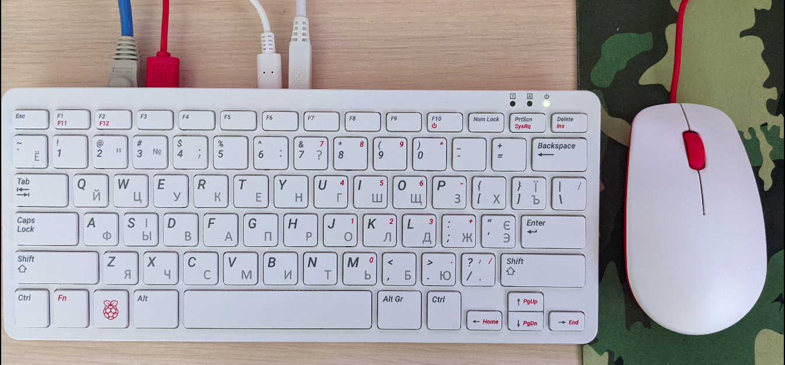

## Introduction

Raspberry Pi 400 specifications are the following:
<ul>
<li>CPU: 64-bit quad-core ARM Cortex-A72 at 1.8GHz</li>
<li>GPU: Video Core VI at 500MHz</li>
<li>RAM: 4GB of LPDDR4</li>
<li>Networking: Gigabit Ethernet. dual-band 802.11ac, bluetooth 5.0, BLE</li>
<li>Audio/Video outputs: 2 x micro-HDMI 2.0</li>
<li>Ports: 1 x USB 2.0 port, 2 x USB 3.0 ports</li>
<li>Storage: micro-SD , up to 512 Gb</li>
<li>Power: 5V at 3A via USB Type-C</li>
<li>Extension: 40-pin GPIO header</li>
</ul>

Raspberry Pi Pico specifications are the following:
<ul>
<li>CPU: RP2040 dual-core ARM Cortex-M0+ at 133 MHz </li>
<li>SRAM: 264 kB</li>
<li>Flash: 2 Mb</li>
<li>Ports: 1 x USB 1.1 port</li>
<li>Peryphery: 26 x GPIO, 2 x SPI, 2 x I2C, 2 x UART, 3 x ADC, 16 x PWM, 1 x RTC, 8 x PIO</li>
</ul>

The Raspberry Pi 400 is a reincarnation of the ZX Spectrum computer, meaning that it is a single-board computer with integrated keyboard.
The Raspberry Pi Pico is a development board, that contains SWD interface to debug a firmware, GPIOs for connection of different sensors,
a micro-USB connector to power the board and communication via a virtual USB-UART port.

The Raspberry Pi 400 has an expansion 40-pin GPIO connector to connect to other devices, such as different HATs and Raspberry Pi Pico.

## Toolchain
### Raspberry Pi 400 toolchain
Since the Raspberry Pi 400 is a full-featured Linux computer, there is possible to use it as a host system to compile all provided examples
for the following targets: RASPBERRY-PI and POSIX.
It can also be used to cross-compile and debug Raspberry Pi Pico firmwares.

If required, install all additional packages:
~~~
$ sudo apt install cmake git
~~~

The Raspberry Pi 400 can be used as a traditional computer or it can be used via SSH (Secure Shell).
If you prefer the second way, please enable the SSH server on your Raspberry Pi 400.
~~~
$ sudo raspi-config
~~~

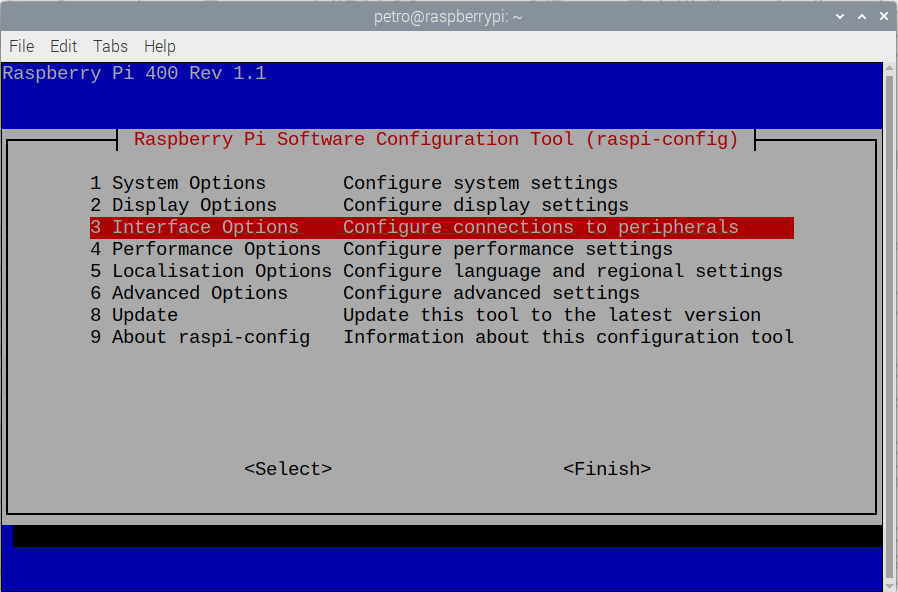

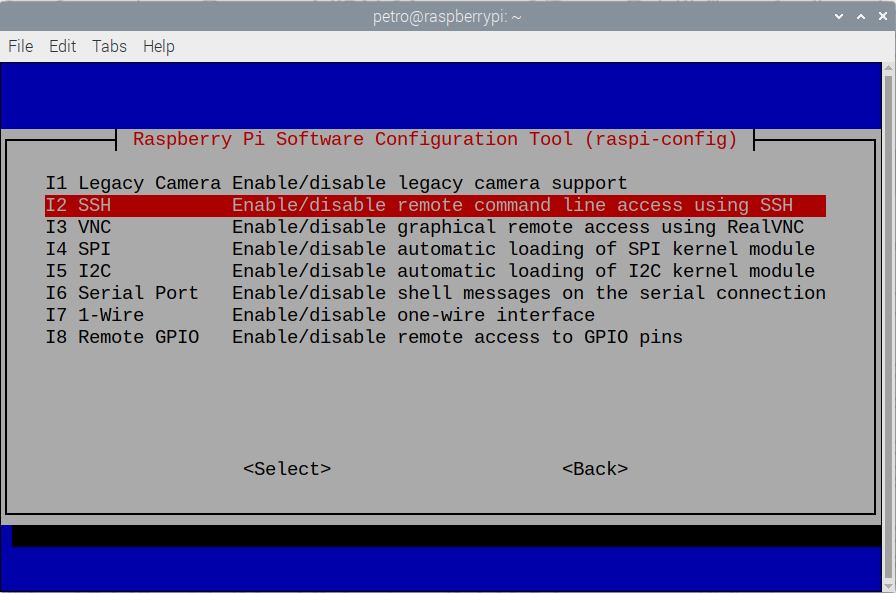

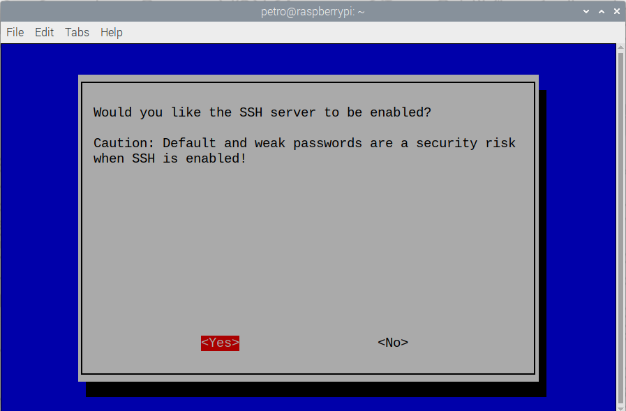

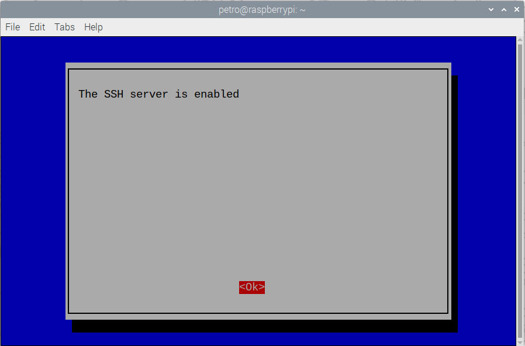

Enable static IP address for your Raspberry Pi 400 to use the same IP every time while SSH connection:

~~~
$ sudo nano /etc/dhcpcd.conf
~~~
~~~
nodhcp
~~~
~~~
interface eth0
static ip_address=192.168.0.115/24
static routers=192.168.0.1
static domain_name_servers=192.168.0.1
~~~
~~~
interface wlan0
static ip_address=192.168.0.116/24
static routers=192.168.0.1
static domain_name_servers=192.168.0.1
~~~
Connect to your Raspberry Pi 400 via SSH:
~~~
$ ssh -X <username>@<IP address>
~~~
In my case it looks like this:
~~~
petro@DellVostro:~$ ssh -X petro@192.168.0.115
The authenticity of host '192.168.0.115 (192.168.0.115)' can't be established.
ECDSA key fingerprint is SHA256:J2F0G6/x24g640px3Z7wIQN6T2BlKQ4I32PTxI9G3HM.
Are you sure you want to continue connecting (yes/no/[fingerprint])? yes
Warning: Permanently added '192.168.0.115' (ECDSA) to the list of known hosts.
petro@192.168.0.115's password: 
Linux raspberrypi 5.15.32-v7l+ #1538 SMP Thu Mar 31 19:39:41 BST 2022 armv7l

The programs included with the Debian GNU/Linux system are free software;
the exact distribution terms for each program are described in the
individual files in /usr/share/doc/*/copyright.

Debian GNU/Linux comes with ABSOLUTELY NO WARRANTY, to the extent
permitted by applicable law.
Last login: Fri Jul 22 12:51:39 2022

Wi-Fi is currently blocked by rfkill.
Use raspi-config to set the country before use.

petro@raspberrypi:~ $ 
~~~
The toolchain is already installed on your Raspberry Pi 400.
Check versions of the installed utilities:
~~~
$ gcc --version
$ g++ --version
$ gdb-multiarch --version
$ make --version
$ cmake --version
~~~
### Raspberry Pi Pico toolchain
If you decided to use the Raspberry Pi 400 as a host system to develop Raspberry Pi Pico firmwares,
the toolchain installation will be very simple:
~~~
$ wget https://raw.githubusercontent.com/raspberrypi/pico-setup/master/pico_setup.sh
$ chmod +x pico_setup.sh
$ ./pico_setup.sh
$ sudo reboot
~~~
For more details, please read the official Raspberry Pi Pico documentation https://www.raspberrypi.com/documentation/microcontrollers/c_sdk.html.
After the installation you can check versions of the installed utilities and the path to the SDK:
~~~
$ arm-none-eabi-gcc --version
$ arm-none-eabi-g++ --version
$ openocd --version
$ echo $PICO_SDK_PATH
~~~

## Wiring between the devices

Both the Raspberry Pi 400 and the Raspberry Pi Pico have 40-pin GPIO headers, but the pinout is different.

### Raspbery Pi 400 pinout

To see the pinout of the GPIO header on any Raspberry Pi board, just enter the following command:

~~~
$ pinout
~~~

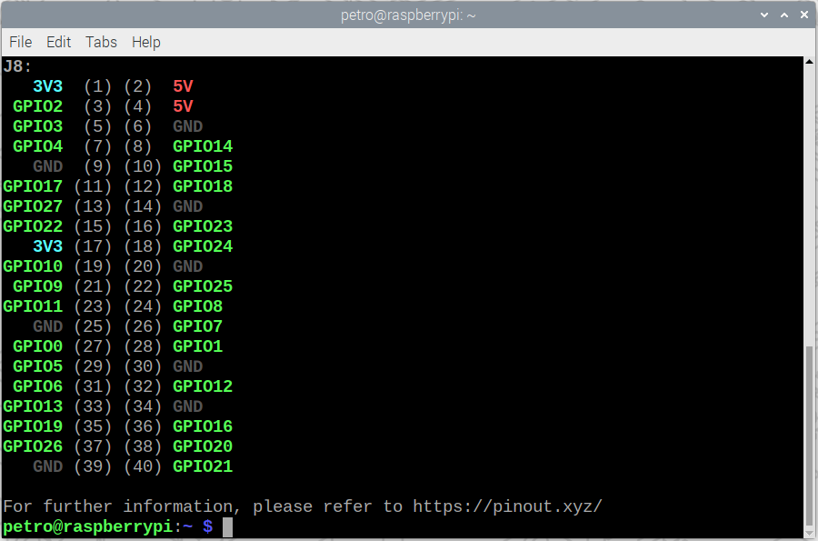

For more details, please refer to https://pinout.xyz/

### Raspberry Pi Pico pinout

The Raspberry Pi Pico pinout is shown on the following figure:

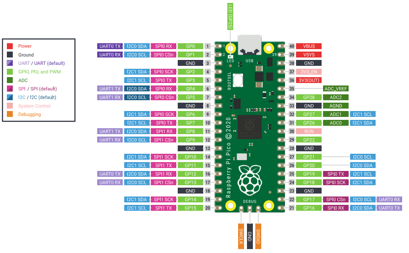

### Raspberry Pi Pico W pinout

The Raspberry Pi Pico W (with WLAN) pinout is shown on the next figure:

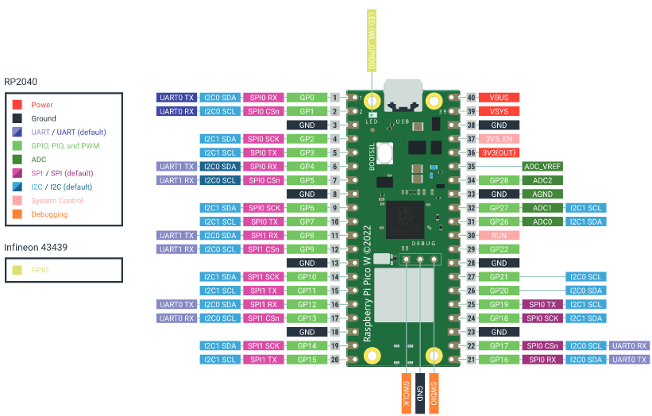

### Wiring table (Raspberry Pi Pico)
There are used the following pins to connect the Pico to the Raspberry Pi 400:

<table>
<tr>
<th>Raspberry Pi 400</th>
<th></th>
<th>Raspberry Pi Pico</th>
<th></th>
</tr>
<tr>
<td>Pin</td>
<td>Name</td>
<td>Name</td>
<td>Pin</td>
</tr>
<tr>
<td>2</td>
<td>5V</td>
<td>VSYS</td>
<td>39</td>
</tr>
<tr>
<td>5</td>
<td>GPIO3</td>
<td>RUN</td>
<td>30</td>
</tr>
<tr>
<td>6</td>
<td>GND</td>
<td>GND</td>
<td>38</td>
</tr>
<tr>
<td>8</td>
<td>GPIO14(TXD)</td>
<td>UART0_RX</td>
<td>2</td>
</tr>
<tr>
<td>9</td>
<td>GND</td>
<td>GND</td>
<td>3</td>
</tr>
<tr>
<td>10</td>
<td>GPIO15(RXD)</td>
<td>UART0_TX</td>
<td>1</td>
</tr>
<td>18</td>
<td>GPIO24(SWDIO)</td>
<td>DEBUG SWDIO</td>
<td>-</td>
</tr>
<tr>
<td>22</td>
<td>GPIO25(SWCLK)</td>
<td>DEBUG SWCLK</td>
<td>-</td>
</tr>
<tr>
<tr>
<td>25</td>
<td>GND</td>
<td>DEBUG GND</td>
<td>-</td>
</tr>
<tr>
<td>19</td>
<td>GPIO10(SPI0 MOSI)</td>
<td>SPI0 RX</td>
<td>6</td>
</tr>
<tr>
<td>21</td>
<td>GPIO9(SPI0 MISO)</td>
<td>SPI0 TX</td>
<td>5</td>
</tr>
<tr>
<td>23</td>
<td>GPIO11(SPI0 SCLK)</td>
<td>SPI0 SCK</td>
<td>4</td>
</tr>
<tr>
<td>24</td>
<td>GPIO8(SPI0 CE0)</td>
<td>SPI0 CSn</td>
<td>7</td>
</tr>
<tr>
<td>39</td>
<td>GND</td>
<td>GND</td>
<td>8</td>
</tr>
</table>

### Wiring table (Raspberry Pi Pico W)

Since the Raspberry Pi Pico W has an own network interface, there is no need to provide an interconnection between the devices while they are running, except for debugging.
Thus, the wiring table became simpler:

<table>
<tr>
<th>Raspberry Pi 400</th>
<th></th>
<th>Raspberry Pi Pico W</th>
<th></th>
</tr>
<tr>
<td>Pin</td>
<td>Name</td>
<td>Name</td>
<td>Pin</td>
</tr>
<tr>
<td>2</td>
<td>5V</td>
<td>VSYS</td>
<td>39</td>
</tr>
<tr>
<td>6</td>
<td>GND</td>
<td>GND</td>
<td>38</td>
</tr>
<tr>
<td>8</td>
<td>GPIO14(TXD)</td>
<td>UART0_RX</td>
<td>2</td>
</tr>
<tr>
<td>9</td>
<td>GND</td>
<td>GND</td>
<td>3</td>
</tr>
<tr>
<td>10</td>
<td>GPIO15(RXD)</td>
<td>UART0_TX</td>
<td>1</td>
</tr>
<td>18</td>
<td>GPIO24(SWDIO)</td>
<td>DEBUG SWDIO</td>
<td>-</td>
</tr>
<tr>
<td>22</td>
<td>GPIO25(SWCLK)</td>
<td>DEBUG SWCLK</td>
<td>-</td>
</tr>
<tr>
<tr>
<td>25</td>
<td>GND</td>
<td>DEBUG GND</td>
<td>-</td>
</tr>
</table>

### Wiring example
Plug in external wires to the GPIO header directly or using a GPIO adapter:

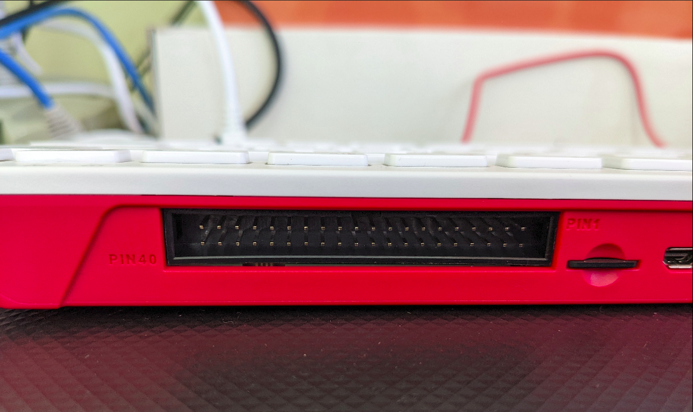

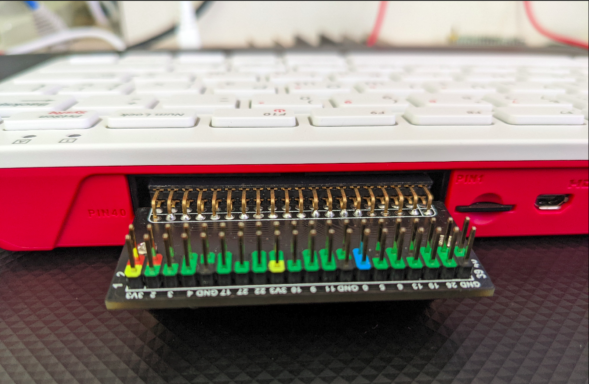

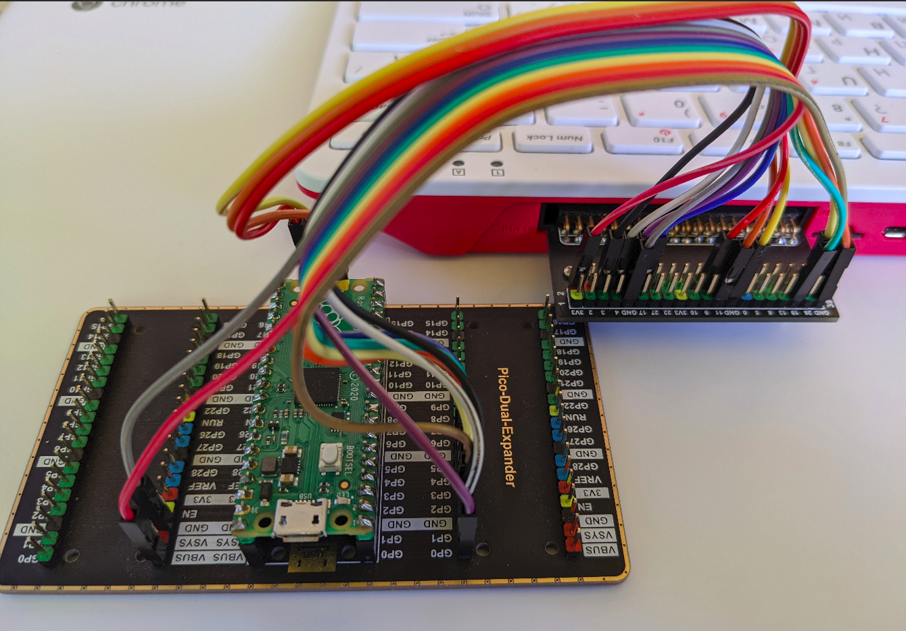