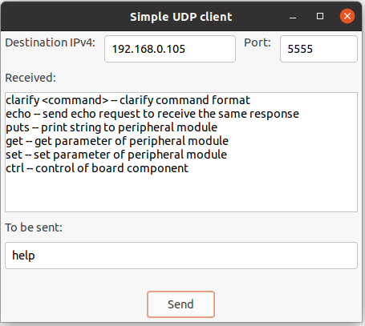

# Python utilities
This directory contains several additional utilities written in python to test provided
here examples.
The utilities can be launched in both console and GUI modes.
There is used the wxPython Phoenix library to provide GUI which is based on the wxWidgets library.

## Requirements
Make sure you have Python3 version 3.8 or later installed.

Install the wxPython Phoenix library and all its dependencies:

### Ubuntu 20.04 LTS
~~~
$ sudo apt install libgtk-3-dev python3-pip
$ pip install -U -f https://extras.wxpython.org/wxPython4/extras/linux/gtk3/ubuntu-20.04 wxPython
~~~ 

### Raspberry Pi OS
~~~
$ sudo apt install libgtk-3-dev python3-pip
$ pip install -U -f https://extras.wxpython.org/wxPython4/extras/linux/gtk3/debian-10 wxPython
~~~ 

## Simple UDP client
This simple UDP client is intended to test the udp-server example from examples/NUCLEO-F429ZI/udp-server.
Make sure both the UDP client and server are located in the same network (the network address must match).
To run the client in GUI mode, please launch the following command:
~~~
$ python3 udp-client.py --gui
~~~

Use the following command to run the client in the console mode:
~~~
$ python3 udp-client.py -a <server IP address> -p <server port>
~~~

Where:

<b>server IP address</b> is an address of an UDP server, which is launchen on the NUCLEO-F429ZI board, for example

<b>server port</b> is an port number of an UDP server, that equals <b>5555</b> for the udp-server example

### Example of use
Make sure you have the minicom utility installed.
If not, install it now:
~~~
$ sudo apt update
$ sudo apt install minicom -y
~~~
<ol>
<li>Open the first terminal window and launch monitor.sh:</li>

~~~
$ cd ~/libcoapcpp/examples/NUCLEO-F429ZI
$ ./monitor.sh
[StartIpAssignerTask:275] IP address assigned by DHCP: 192.168.000.105
                                                        
[StartUdpServerTask:294] server object created          

[StartUdpServerTask:300] set_received_packed_handler_callback

[StartUdpServerTask:302] start

[StartUdpServerTask:304] process2

[process2:142] Entering process2

[process2:158] poll() : receive timeout 5 seconds is over                 
                                                                                
[handle_request:54] Entering handle_request                                     
                                                                                
[handler:124] Entering handler                                                  
                                                                                
[help_cmd_handler:151] help                                                     
                                                                                
[handler:139] Leaving handler                                                   
                                                                                
[handle_request:93] Leaving handle_request 
~~~
Press Ctrl+A Q to exit from minicom.

<li>Open the second terminal window and launch the UDP client:</li>

~~~
$ cd ~/libcoapcpp/utilities
$ python3 udp-client.py -a 192.168.0.105 -p 5555
> help
<-- ( ('192.168.0.105', 5555) ) :
clarify <command> -- clarify command format
echo -- send echo request to receive the same response
puts -- print string to peripheral module
get -- get parameter of peripheral module
set -- set parameter of peripheral module
ctrl -- control of board component

> quit

~~~

Or launch the UDP client in GUI mode:
~~~
$ python3 udp-client.py --gui
~~~

Fill in the 'Destination IPv4' field with IP address of the UDP server.
'Port' should be filled with port number 5555.
Enter the 'help' command in the 'To be sent' field and click the 'Send' button:

</ol>